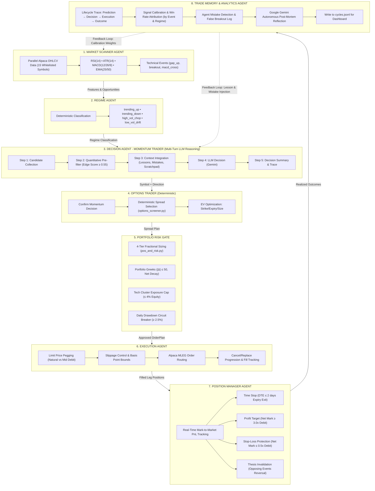

# PACA — Position-Aware Agentic Capital Allocator

An options trading system built for the [**Alpaca AI Trading Agents Hackathon**](https://lablab.ai/ai-hackathons/alpaca-ai-trading-agents-hackathon) (Aug 28 – Sep 4, 2026, submissions due Sep 4 15:00 UTC). PACA trades **debit vertical spreads** using:

- **8-agent multi-agent architecture** (LangGraph) as the main live trading system
- Real-time market scanning, multi-turn LLM reasoning, spread selection, risk management, and mechanical exits
- Deterministic safety core shared between agents and fallback CLI

## 🎯 Key Features

- **8-Agent Multi-Agent Architecture**: LangGraph-based pipeline as the main live trading system
- **Multi-Turn LLM Reasoning**: Momentum Trader with step-by-step reasoning (candidate collection, quantitative filter, context integration, LLM decision, trace)
- **Real-Time Parallel Scanning**: Concurrent market data ingestion across 15 whitelisted symbols with pre-fetched account state
- **Advanced Risk Management**: 4-tier equity risk caps, portfolio Greeks limits, EV optimization, and daily drawdown protection
- **Mechanical Exit System**: Automated profit targets, stop-losses, time stops, and thesis invalidation exits
- **Closed-Loop Memory**: Trade lifecycle tracking, win-rate calibration, and post-mortem reflection for continuous improvement
- **Live Dashboards**: Real-time Surge.sh deployments for cycle monitoring and candlestick chart visualization
- **Paper Trading Only**: Strict safety controls with paper-only enforcement and deterministic risk guards

> [!TIP]
> **Live Dashboards**, updated automatically on trading cycles:
> - [**alpaca-hackathon-2026-artifacts-paca-cycles.surge.sh**](https://alpaca-hackathon-2026-artifacts-paca-cycles.surge.sh)
>   — cycle journal, open positions with unrealized PnL, realized PnL per closed spread, and live trading configuration.
> - [**alpaca-hackathon-2026-artifacts-paca-candles.surge.sh**](https://alpaca-hackathon-2026-artifacts-paca-candles.surge.sh)
>   — interactive 5m candlestick chart displaying spread entries/exits overlaid with RSI/ATR/MACD indicators, EMA 25/50 anchors, and trigger bars.
>
> Architecture & deployment details: [docs/DASHBOARDS.md](docs/DASHBOARDS.md).

---

## 🏛️ System Architecture

### Multi-Agent Pipeline with Multi-Turn Reasoning



---

### Core Components

**Agents** (`agents/`):
- Market Scanner, Regime, Decision (Momentum Trader), Options Trader, Risk Gate, Execution, Position Manager, Trade Memory

**Shared Core**:
- `graph/trading_graph.py` - LangGraph orchestration
- `graph/state.py` - Shared AgentState
- `signals.py`, `options_screener.py`, `pos_and_risk.py` - Deterministic calculations
- `broker.py` - Alpaca API gateway
- `decision_layer.py` - LLM integration

**CLI**:
- `multi_agent_cli.py` - Main multi-agent pipeline for live trading
- `cli.py` - Deterministic fallback CLI for testing and manual mode

---

## 🧠 Memory & Feedback

### Memory Subsystems
1. **Working Scratchpad**: Tracks setup narratives per symbol across bars to prevent amnesic evaluation
2. **Trade Lifecycle Memory**: Logs complete trade traces with post-mortem reflections
3. **Reasoning Traces**: Records step-by-step LLM reasoning for auditability

### Feedback Loops
1. **Lesson Injection**: Trade mistakes feed back into Momentum Trader context
2. **Reasoning Feedback**: Each step logs to traces for debugging
3. **Calibration Loop**: Tracks win rates by event and regime

---

##  Trading Methodology

**Strategy**: Momentum-based debit vertical spreads on liquid US stocks/ETFs.

**Underlyings**: SPY, QQQ, IWM, AAPL, NVDA, TSLA, MSFT, AMZN, IBIT, MSTR, SLV, WMT, GLD, USO, XLE

**Timeframe**: 5-minute bars, runs every 5 minutes

**Entry Signals**:
- Gap: Price moves > 2× ATR from previous close
- Breakout: Price moves > 2× ATR from open
- MACD Cross: Histogram crosses zero with magnitude ≥ 0.05× ATR

**Entry Filters**:
- RSI Overbought (≥70): Blocks CALL entries
- RSI Oversold (≤30): Blocks PUT entries
- Trend Anchors: EMA 25 and EMA 50 for direction confirmation

**Spread Selection**:
- Expiry: 5-45 days to expiration
- Width: 1-5% of spot price
- Debit: 25-45% of spread width (ensures ≥1.2 reward-to-risk)

**Position Sizing**:
- Per entry: 0.5% of equity
- Per underlying: 1.5% max
- Per cycle: 1% max (2 entries)
- Total open: 10% max
- Stacking: Allowed for same-direction adds

**Mechanical Exits**:
- Profit Target: 3.0× entry debit (+200%)
- Stop Loss: 0.5× entry debit (-50%)
- Time Stop: Close at ≤2 DTE
- Reversal: Exit on opposing signal

---

## ⚡ Multi-Agent Pipeline (8 Steps)

1. **Market Scanner Agent**: Parallel OHLCV ingestion + account pre-fetch + indicator calculation across all 15 symbols concurrently.
2. **Regime Agent**: Fast deterministic classification (`trending_up`, `trending_down`, `high_vol_chop`, `low_vol_drift`).
3. **Decision Agent (Momentum Trader)**: Multi-turn LLM reasoning with candidate collection, quantitative pre-filter (edge score ≥ 0.55), context integration (lessons, mistakes, scratchpad), and LLM decision via Gemini.
4. **Options Trader Agent**: Deterministic spread selection and EV optimization based on momentum decision.
5. **Portfolio Risk Gate & EV Optimizer**: Expected Value calculation, 4-tier equity risk caps, tech cluster limit, and daily drawdown protection.
6. **Execution Agent**: Limit price pegging between natural and mid debit, slippage control, and Alpaca MLEG order formatting.
7. **Position Manager Agent**: Mark-to-market valuations and deterministic exit execution.
8. **Trade Memory & Analytics Agent**: Audit lifecycle recording, win-rate calibration, mistake identification, Gemini post-mortem review, and cycles.jsonl journal writing for dashboard.

---

## 🚀 Getting Started

### 1. Installation & Environment Setup
Requires Python 3.11 and [uv](https://docs.astral.sh/uv/):

```bash
uv sync
cp .env.example .env
```

Configure your `.env` file:
```ini
ALPACA_API_KEY=your_alpaca_paper_key
ALPACA_SECRET_KEY=your_alpaca_paper_secret
ALPACA_PAPER=true
GEMINI_API_KEY=your_gemini_api_key
```

### 2. Verify System
Run the full offline test suite:
```bash
uv run pytest
```

### 3. Diagnostics & Preflight
```bash
# Validates settings.yaml, credentials, paper-only flags, and Alpaca API connectivity
uv run --env-file .env cli.py preflight

# View account equity, options level 3 verification, and open positions
uv run --env-file .env cli.py account

# Inspect live indicator values and gate statuses across the whitelist
uv run --env-file .env cli.py candidates

# Screen optimal vertical debit spread for a given symbol and direction
uv run --env-file .env cli.py screen SPY --direction CALL
```

### 4. PnL & Performance Inspection
```bash
# Display unrealized PnL on open spreads based on live Alpaca marks
uv run --env-file .env pnl.py positions [--json]

# Display realized PnL per closed spread from historical filled orders
uv run --env-file .env pnl.py realized [--json] [--days 30]

# Export candle data for the interactive paca-candles dashboard
uv run --env-file .env python export_candles.py --days 10
```

### 5. Running Trading Cycles

**Live paper execution uses the deterministic procedural CLI (`cli.py`), not the multi-agent architecture.**

#### Dry-Run Simulation (Safe Mode)
```bash
# Deterministic CLI dry-run (interactive manual pick or pass)
uv run --env-file .env cli.py run --manual-mode

# Multi-agent pipeline performance dry-run (for testing/benchmarking only)
uv run --env-file .env python multi_agent_cli.py test-performance
```

#### Live Paper Execution (Deterministic CLI)
```bash
# Single cycle execution (submits real paper orders via MLEG limit)
uv run --env-file .env cli.py run --manual-mode --execute

# Autonomous loop running every bar interval (5 minutes)
uv run --env-file .env cli.py run --execute --loop
```

### 6. Multi-Agent Testing & Benchmarking (No Live Trading)
```bash
# Benchmark multiple cycles to measure latency and agent throughput
uv run --env-file .env python multi_agent_cli.py benchmark --cycles 5

# Analyze latency bottlenecks and timeout risks across the agents
uv run --env-file .env python multi_agent_cli.py analyze-bottlenecks

# Benchmark multi-agent vs procedural mode
uv run --env-file .env python multi_agent_cli.py compare-modes
```

---

## 📁 Project Structure

```
paca/
├── agents/                    # Multi-agent system implementation
│   ├── __init__.py
│   ├── base_agent.py         # Base agent class with performance monitoring
│   ├── market_scanner.py     # Fast opportunity scanner agent
│   ├── regime_agent.py       # Market regime classification agent
│   ├── decision_agent.py     # Momentum Trader with multi-turn LLM reasoning
│   ├── options_trader.py     # Deterministic spread selection & EV optimization
│   ├── risk_gate.py          # Portfolio risk gate & EV optimizer
│   ├── execution_agent.py    # Order execution agent
│   ├── position_manager.py   # Real-time position manager agent
│   └── trade_memory.py       # Trade memory & analytics agent
├── graph/                     # LangGraph orchestration
│   ├── __init__.py
│   ├── state.py              # Agent state management
│   └── trading_graph.py      # Multi-agent pipeline orchestration
├── docs/                      # Documentation
│   ├── DASHBOARDS.md         # Dashboard deployment details
│   ├── SPREAD_SELECTION.md   # Spread selection methodology
│   ├── TODO.md               # Outstanding issues and follow-ups
│   └── trading_review.md     # Post-close trading reviews
├── surge_artifacts/           # Surge.sh dashboard deployments
│   ├── paca-cycles/          # Cycle monitor dashboard
│   └── paca-candles/         # Candlestick chart dashboard
├── tests/                     # Test suite
├── .claude/                   # Claude Code skills
│   └── skills/                # Specialized skills for this project
├── broker.py                  # Alpaca API gateway
├── cli.py                     # Main CLI interface
├── multi_agent_cli.py         # Multi-agent CLI with performance profiling
├── market_data.py             # Market data fetching
├── signals.py                 # Technical analysis & event detection
├── decision_layer.py          # LLM decision layer
├── options_screener.py        # Options spread screening
├── pos_and_risk.py            # Position sizing & risk management
├── pnl.py                     # PnL calculation
├── export_candles.py         # Candle data export for dashboards
├── data_models.py             # Data models
├── settings.py                # Settings validation
├── settings.yaml              # Trading configuration
└── sounds.py                  # Audio alerts
```

## 🤖 Claude Code Skills

The repository includes specialized Claude Code skills in `.claude/skills/`:

1. **`/paca-agent`**: Runs a full autonomous cycle with Claude reasoning in the open as the entry decider, validating fills, and redeploying the Surge dashboard.
   ```
   /paca-agent
   ```
   To run on a 5-minute loop until market close:
   ```
   /loop 5m /paca-agent — before starting each cycle check the current time; if it is 4:01pm ET or later, or the market is closed, do NOT run the cycle: stop the loop immediately
   ```

2. **`/whitelist-candidates`**: Vets candidate underlyings for liquidity, options strike availability, and spread width viability before adding them to `settings.yaml`.
   ```
   /whitelist-candidates COIN CVX TLT
   ```

3. **`/trading-review`**: Post-close review tool that analyzes the day's cycle journal, grades entry decisions against subsequent price moves, computes realized PnL, and updates [docs/trading_review.md](docs/trading_review.md).
   ```
   /trading-review
   ```

4. **`/surge-artifacts`**: Design and publish standalone HTML pages — reports, explainers, demos, dashboards, mini-sites — to surge.sh at miroai-artifacts-<slug>.surge.sh.

---

## 🛡️ Safety Hard Guards

- **Strict Paper-Only Enforcement**: Startup immediately aborts if `ALPACA_PAPER != true` or if any live trading endpoint is detected.
- **Hard-Coded Client Safety**: `TradingClient(paper=True)` is enforced in `broker.py`.
- **Single Order Chokepoint**: `broker.submit_paper_order` is the single function in the codebase permitted to submit orders.
- **Deterministic Order Routing**: Formatted as Alpaca Multi-Leg (MLEG) limit orders with cycle-stamped `client_order_id`.
- **Credential Leak Prevention**: Vendor exceptions are wrapped to type names (`from None`) so secrets and authorization tokens never reach logs.
- **Options Level 3 Guard**: Verifies that the Alpaca paper account has approved Options Trading Level $\ge 3$ before arming any order.
- **Unpaired Leg Isolation**: Unrecognized or non-spread positions are flagged and never modified.
- **Dry-Run Default**: The system defaults to dry-run simulation unless `--execute` is explicitly supplied.
- **Performance Timeouts**: Each agent has timeout protection (1.0-4.0s depending on complexity) with fallback logic to prevent cascade failures.
- **Bottleneck Detection**: System automatically detects and logs performance bottlenecks with fallback mechanisms.

## 🔄 Workflow

### Live Paper Trading (Deterministic CLI)

Uses `cli.py` - sequential procedural execution with the same deterministic logic:

1. Fetch market data and account state
2. Calculate indicators and detect events
3. Run LLM decision or manual mode
4. Screen spreads and apply risk sizing
5. Submit orders via Alpaca MLEG
6. Monitor positions and execute mechanical exits
7. Write to cycles.jsonl for dashboard

### Multi-Agent Testing (multi_agent_cli.py)

Used for architecture demonstration and benchmarking only - does not execute live trades:

1. Market Scanner → Regime → Decision (Momentum Trader) → Options Trader → Risk Gate → Execution → Position Manager → Trade Memory
2. All agents share AgentState
3. Performance monitoring and bottleneck detection

### Development Workflow

1. **Configuration**: Edit `settings.yaml`
2. **Testing**: Run `uv run pytest` (270 tests)
3. **Preflight**: Run `uv run --env-file .env cli.py preflight`
4. **Dry-Run**: Test with `uv run --env-file .env cli.py run --manual-mode`
5. **Live Trading**: Execute with `uv run --env-file .env cli.py run --execute --loop`
