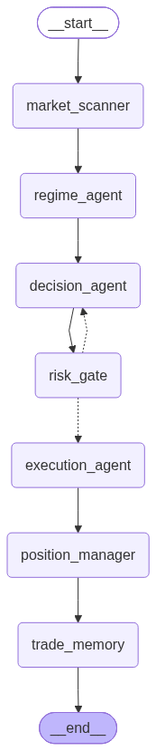
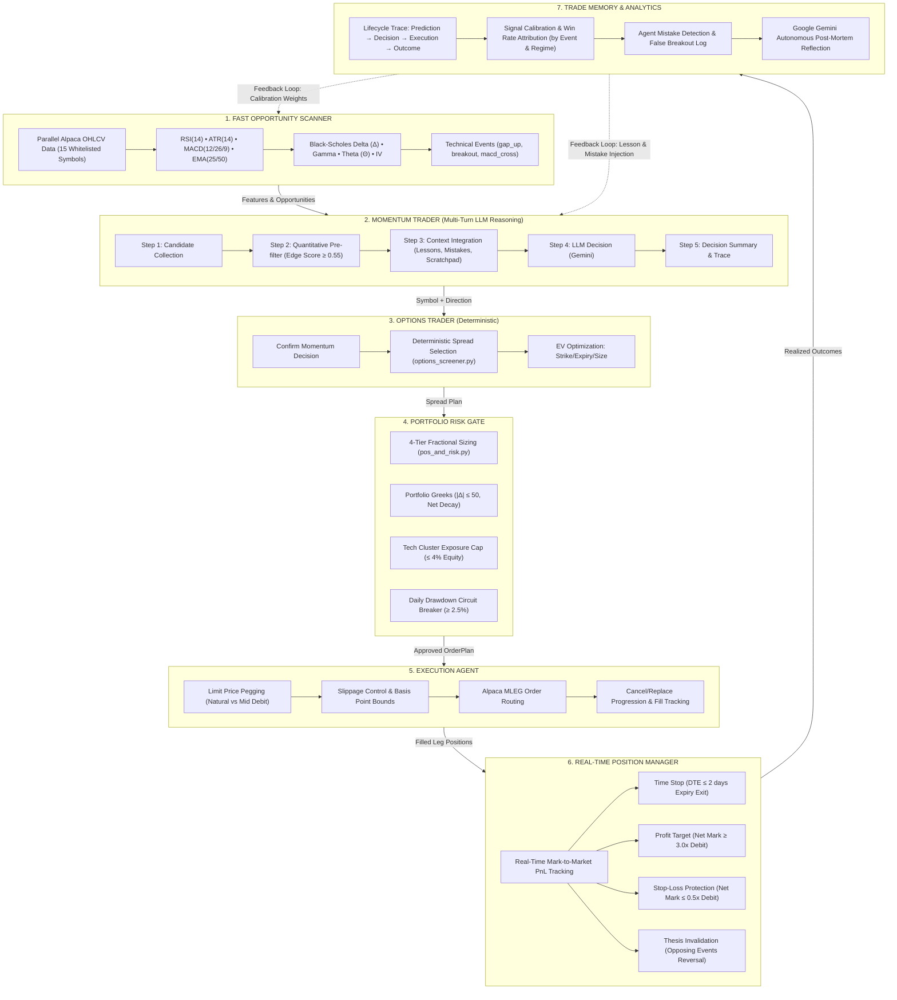

# PACA — Position-Aware Agentic Capital Allocator

An autonomous multi-agent options trading system built for the [**Alpaca AI Trading Agents Hackathon**](https://lablab.ai/ai-hackathons/alpaca-ai-trading-agents-hackathon) (Aug 28 – Sep 4, 2026, submissions due Sep 4 15:00 UTC). PACA trades **debit vertical spreads** using real-time parallel market scanning, multi-turn LLM reasoning for momentum trading, deterministic options spread selection, dynamic risk management, closed-loop memory calibration, and active mechanical position management.

## 🎯 Key Features

- **2-Agent Core Architecture**: Momentum Trader (LLM-based) + Options Trader (deterministic) with multi-turn reasoning traces
- **Multi-Turn LLM Reasoning**: Step-by-step reasoning with full traceability for momentum trading decisions
- **Real-Time Parallel Scanning**: Concurrent market data ingestion across 15 whitelisted symbols with pre-fetched account state
- **Advanced Risk Management**: 4-tier equity risk caps, portfolio Greeks limits, EV optimization, and daily drawdown protection
- **Mechanical Exit System**: Automated profit targets, stop-losses, time stops, and thesis invalidation exits
- **Closed-Loop Memory**: Trade lifecycle tracking, win-rate calibration, and post-mortem reflection for continuous improvement
- **Live Dashboards**: Real-time Surge.sh deployments for cycle monitoring and candlestick chart visualization
- **Paper Trading Only**: Strict safety controls with paper-only enforcement and deterministic risk guards

> [!TIP]
> **Live Dashboards**, updated automatically on trading cycles:
> - [**alpaca-hackathon-2026-artifacts-paca-cycles.surge.sh**](https://alpaca-hackathon-2026-artifacts-paca-cycles.surge.sh)
>   — cycle journal, open positions with unrealized PnL, realized PnL per closed spread, and live trading configuration.
> - [**alpaca-hackathon-2026-artifacts-paca-candles.surge.sh**](https://alpaca-hackathon-2026-artifacts-paca-candles.surge.sh)
>   — interactive 5m candlestick chart displaying spread entries/exits overlaid with RSI/ATR/MACD indicators, EMA 25/50 anchors, and trigger bars.
>
> Architecture & deployment details: [docs/DASHBOARDS.md](docs/DASHBOARDS.md).

---

## 🏛️ System Architecture

### Multi-Agent Pipeline with Multi-Turn Reasoning




```

---

### Core Module Breakdown

| Diagram box | Module | Job |
|---|---|---|
| Multi-Agent Orchestration | [`graph/trading_graph.py`](graph/trading_graph.py) | LangGraph StateGraph with 7-agent pipeline, conditional edges, performance monitoring |
| Agent State Management | [`graph/state.py`](graph/state.py) | Shared AgentState dataclass, memory subsystems, debate history, performance tracking |
| Market Scanner Agent | [`agents/market_scanner.py`](agents/market_scanner.py) | Parallel OHLCV ingestion, pre-fetched account state, indicator calculation across all symbols |
| Regime Agent | [`agents/regime_agent.py`](agents/regime_agent.py) | Deterministic market regime classification (trending_up, high_vol_chop, etc.) |
| Decision Agent | [`agents/decision_agent.py`](agents/decision_agent.py) | 2-Round Dialectical Debate (Bull vs. Bear vs. Options) with Critic arbitration |
| Risk Gate Agent | [`agents/risk_gate.py`](agents/risk_gate.py) | 4-tier equity risk caps, portfolio Greeks limits, EV optimization, daily drawdown protection |
| Execution Agent | [`agents/execution_agent.py`](agents/execution_agent.py) | Limit price pegging, slippage control, Alpaca MLEG order formatting |
| Position Manager Agent | [`agents/position_manager.py`](agents/position_manager.py) | Real-time mark-to-market PnL, DTE time stops, thesis invalidation exits |
| Trade Memory Agent | [`agents/trade_memory.py`](agents/trade_memory.py) | Lifecycle trace recording, win-rate calibration, mistake identification, post-mortem reflection |
| Entry signal (market data) | [`market_data.py`](market_data.py) | OHLCV DataFrame for one symbol at a time, any bar timeframe |
| Entry signal (analysis) | [`signals.py`](signals.py) | RSI/ATR/MACD + event detection (gap, breakout, MACD chop filter) + entry gates (pure) |
| Entry signal (decision) | [`decision_layer.py`](decision_layer.py) | Gemini LLM (OpenAI fallback) — or `--manual-mode` — picks entries conditioned on trend anchors & past lessons |
| Option screener | [`options_screener.py`](options_screener.py) | Expiry selection, spread enumeration, liquidity filter, debit-fraction band, EV ranking (pure) |
| Risk & Position manager | [`pos_and_risk.py`](pos_and_risk.py) | Leg pairing, mechanical exits, 4-tier equity-relative sizing, position stacking (pure) |
| Execution + Account state | [`broker.py`](broker.py) | Alpaca paper API gateway; ThreadPoolExecutor snapshots; `submit_paper_order` chokepoint |
| PnL & Performance | [`pnl.py`](pnl.py) & [`export_candles.py`](export_candles.py) | Realized/open PnL calculation and 5m candle chart data generator |
| Orchestration & CLI | [`cli.py`](cli.py) & [`multi_agent_cli.py`](multi_agent_cli.py) | Typer CLI commands, cycle loop, 7-agent pipeline execution & performance profiler |
| Configuration | [`settings.yaml`](settings.yaml) & [`settings.py`](settings.py) | Validated single configuration source with strict bounds checks |
| Data models | [`data_models.py`](data_models.py) | Frozen dataclasses, immutable data structures, JSON serialization |

---

## 🧠 Memory Subsystems & Active Feedback Loops

PACA implements 3 persistent memory layers and 3 active feedback loops to continuously refine trading decisions across consecutive cycles:

### Memory Subsystems
1. **Inter-Cycle Working Scratchpad Memory (`working_scratchpad`)**:
   - Location: [`graph/state.py`](graph/state.py) & [`agents/decision_agent.py`](agents/decision_agent.py)
   - Tracks setup narratives per symbol across 5-minute bars (e.g. `{"MSFT": "[14:35] Active Thesis (BUY_CALL): Consensus confirmed after Bear debate..."}`). Prevents amnesic bar evaluation.
2. **Trade Lifecycle Memory (`TradeMemoryRecord`)**:
   - Location: [`agents/trade_memory.py`](agents/trade_memory.py) & `logs/trade_memory.jsonl`
   - Logs complete trade traces (`prediction → decision → execution → outcome`) with autonomous post-mortem reflections.
3. **Multi-Turn Reasoning Traces (`reasoning_traces`)**:
   - Location: [`graph/state.py`](graph/state.py) & [`agents/decision_agent.py`](agents/decision_agent.py)
   - Records step-by-step reasoning process (Candidate Collection → Quantitative Filter → Context Integration → LLM Decision → Final Summary) with full traceability.

### Active Feedback Loops
1. **Post-Mortem Lesson Injection (Step 7 $\to$ Step 2)**:
   - Feeds historical trade mistakes and calibration lessons from `TradeMemoryAgent` directly into the Momentum Trader's LLM context.
2. **Multi-Turn Reasoning Feedback**:
   - Each reasoning step logs to `reasoning_traces` for full auditability and debugging of decision logic.
3. **Signal & Regime Calibration Loop**:
   - Tracks win rates grouped by technical event (`breakout_up`, `gap_up`) and market regime (`high_vol_chop`), modulating confidence thresholds downstream.

---

## 🔄 Architectural Transformation: Before vs. After Agents

| Feature / Dimension | 🛑 Before (Procedural Architecture) | 🚀 After (Multi-Agent Architecture) |
| :--- | :--- | :--- |
| **Control Flow** | Sequential procedural loop in `cli.py` | Directed 7-Agent Autonomous Pipeline with shared `AgentState` |
| **Market Ingestion** | Sequential symbol-by-symbol bar reading (~3.5s) | Parallel thread-pooled bar collection + pre-fetched account state (<2.2s) |
| **Trade Decision** | Single prompt LLM call or manual prompt | **2-Round Dialectical Debate**: Bull vs. Bear vs. Options Specialists with Rebuttal & Critic Arbitration |
| **Market Regime** | Static indicator thresholds | Dynamic **Regime Agent** categorizing market state (`trending_up`, `high_vol_chop`, etc.) to modulate confidence |
| **Portfolio Risk Sizing** | Basic equity percentage check | **4-Tier Fractional Sizing** + **Portfolio Greeks Limit ($|\Delta| \le 50$)** + **Tech Cluster Cap ($\le 4\%$)** + **Daily Drawdown Breaker ($\ge 2.5\%$)** |
| **Contract Optimization** | Static spread heuristic | **Expected Value (EV)** equation: $\text{EV} = (P_{\text{win}} \times \text{Max Profit}) - (P_{\text{loss}} \times \text{Max Loss})$ |
| **Order Execution** | Immediate order firing | **Natural vs. Mid Limit Pegging**, basis-point slippage bounds, MLEG order lifecycle |
| **Position Management** | Basic end-of-cycle polling | Active Mark-to-Market PnL, **DTE Time Stops ($\le 2\text{d}$)**, **Thesis Invalidation (Opposing Events)**, and automated closing MLEG plans |
| **Trade Memory & Calibration** | Unstructured line append to `cycles.jsonl` | Persistent `TradeMemoryRecord` buffer with **Lesson Injection**, **Scratchpad**, and **Gemini Post-Mortem Reflection** |
| **Cycle Latency** | ~7.3s (repetitive network roundtrips) | **2.18s total cycle** (~27.4 cycles/min) via parallelized snapshot batching & state reuse |
| **Core Safety Math** | 100% Deterministic | Preserved 100% deterministic mathematical core; LLM is only applied where qualitative reasoning enhances the edge |

---

## 📈 Trading Methodology

All numbers below are default settings configured in [settings.yaml](settings.yaml):

- **Underlyings**: Whitelist of liquid US stocks and ETFs (`SPY, QQQ, IWM, AAPL, NVDA, TSLA, MSFT, AMZN, IBIT, MSTR, SLV, WMT, GLD, USO, XLE`).
- **Timeframe**: 5-minute bars (`bar_timeframe: 5m`, `loop_interval_seconds: 300`).
- **Technical Events**:
  - `gap`: $|open - prev\_close| > 2 \times ATR$
  - `breakout`: $|close - open| > 2 \times ATR$
  - `macd_cross`: Histogram crosses zero, subject to magnitude threshold $|hist| \ge 0.05 \times ATR$ (`macd_min_hist_atr`) to filter market chop.
- **Signal Quality Gates**:
  - `rsi_overbought: 70` (drops CALL entry events when RSI $\ge 70$)
  - `rsi_oversold: 30` (drops PUT entry events when RSI $\le 30$)
  - Exits preserve visibility of raw events for capitulation and reversal exits.
- **Advisory Trend Anchors**: Fast EMA (25 bars $\approx 2$h) and Slow EMA (50 bars $\approx 4$h).
- **Vertical Spreads**:
  - Expiries screened: 3 nearest eligible expiries ($\ge 5$ DTE, $\le 45$ DTE).
  - Strike width: $1\%$ to $5\%$ of spot.
  - Debit-fraction band: $0.25$ to $0.45$ of spread width (keeps long leg near ATM while guaranteeing reward-to-risk $\ge 1.2$).
- **Position Sizing & Risk**:
  - `per_entry_fraction: 0.005` (0.5% of account equity per spread)
  - `per_underlying_fraction: 0.015` (1.5% max risk per underlying)
  - `per_cycle_fraction: 0.01` (up to 2 entries per cycle)
  - `total_fraction: 0.10` (10% max open risk)
  - `allow_stacking: true` (allows same-direction adds to existing winners)
- **Mechanical Exits**:
  - Profit Target: Net mark $\ge 3.0\times$ entry debit (+200% return)
  - Stop-Loss: Net mark $\le 0.5\times$ entry debit (-50% loss)
  - Time Stop: DTE $\le 2$ days
  - Reversal Exit: Close position if opposing technical event fires against held direction.

---

## ⚡ The 7-Step Autonomous Pipeline

1. **Fast Opportunity Scanner Agent**: Parallel OHLCV ingestion + account pre-fetch + indicator calculation across all 15 symbols concurrently.
2. **Market Regime Agent**: Fast deterministic classification (`trending_up`, `trending_down`, `high_vol_chop`, `low_vol_drift`).
3. **Trade Intelligence Agent**: 2-Round Dialectical Debate (Bull vs. Bear vs. Options Specialist) with rebuttals, concessions, and Critic arbitration via Gemini.
4. **Portfolio Risk Gate & EV Optimizer**: Expected Value calculation, 4-tier equity risk caps, tech cluster limit, and daily drawdown protection.
5. **Execution Agent**: Limit price pegging between natural and mid debit, slippage control, and Alpaca MLEG order formatting.
6. **Real-Time Position Manager Agent**: Mark-to-market valuations and deterministic exit execution.
7. **Trade Memory & Analytics Agent**: Audit lifecycle recording, win-rate calibration, mistake identification, and Gemini post-mortem review.

---

## 🚀 Getting Started

### 1. Installation & Environment Setup
Requires Python 3.11 and [uv](https://docs.astral.sh/uv/):

```bash
uv sync
cp .env.example .env
```

Configure your `.env` file:
```ini
ALPACA_API_KEY=your_alpaca_paper_key
ALPACA_SECRET_KEY=your_alpaca_paper_secret
ALPACA_PAPER=true
GEMINI_API_KEY=your_gemini_api_key
```

### 2. Verify System
Run the full offline test suite:
```bash
uv run pytest
```

### 3. Diagnostics & Preflight
```bash
# Validates settings.yaml, credentials, paper-only flags, and Alpaca API connectivity
uv run --env-file .env cli.py preflight

# View account equity, options level 3 verification, and open positions
uv run --env-file .env cli.py account

# Inspect live indicator values and gate statuses across the whitelist
uv run --env-file .env cli.py candidates

# Screen optimal vertical debit spread for a given symbol and direction
uv run --env-file .env cli.py screen SPY --direction CALL
```

### 4. PnL & Performance Inspection
```bash
# Display unrealized PnL on open spreads based on live Alpaca marks
uv run --env-file .env pnl.py positions [--json]

# Display realized PnL per closed spread from historical filled orders
uv run --env-file .env pnl.py realized [--json] [--days 30]

# Export candle data for the interactive paca-candles dashboard
uv run --env-file .env python export_candles.py --days 10
```

### 5. Running Trading Cycles

#### Dry-Run Simulation (Safe Mode)
```bash
# Standard CLI dry-run (interactive manual pick or pass)
uv run --env-file .env cli.py run --manual-mode

# 7-Agent Autonomous Pipeline performance dry-run
uv run --env-file .env python multi_agent_cli.py test-performance
```

#### Live Paper Execution
```bash
# Single cycle execution (submits real paper orders via MLEG limit)
uv run --env-file .env cli.py run --manual-mode --execute

# Autonomous loop running every bar interval (5 minutes)
uv run --env-file .env cli.py run --execute --loop
```

### 6. Multi-Agent Performance & Bottleneck Profiling
```bash
# Benchmark multiple cycles to measure latency and agent throughput
uv run --env-file .env python multi_agent_cli.py benchmark --cycles 5

# Analyze latency bottlenecks and timeout risks across the 7 agents
uv run --env-file .env python multi_agent_cli.py analyze-bottlenecks

# Benchmark multi-agent vs procedural mode
uv run --env-file .env python multi_agent_cli.py compare-modes

# Run deterministic agent cycle using main system logic
uv run --env-file .env python multi_agent_cli.py run-deterministic

# Run integration test with main system
uv run --env-file .env python multi_agent_cli.py run-integration
```

---

## 📁 Project Structure

```
paca/
├── agents/                    # Multi-agent system implementation
│   ├── __init__.py
│   ├── base_agent.py         # Base agent class with performance monitoring
│   ├── market_scanner.py     # Fast opportunity scanner agent
│   ├── regime_agent.py       # Market regime classification agent
│   ├── decision_agent.py     # 2-round dialectical debate decision agent
│   ├── risk_gate.py          # Portfolio risk gate & EV optimizer
│   ├── execution_agent.py    # Order execution agent
│   ├── position_manager.py   # Real-time position manager agent
│   └── trade_memory.py       # Trade memory & analytics agent
├── graph/                     # LangGraph orchestration
│   ├── __init__.py
│   ├── state.py              # Agent state management
│   └── trading_graph.py      # Multi-agent pipeline orchestration
├── docs/                      # Documentation
│   ├── DASHBOARDS.md         # Dashboard deployment details
│   ├── SPREAD_SELECTION.md   # Spread selection methodology
│   ├── TODO.md               # Outstanding issues and follow-ups
│   └── trading_review.md     # Post-close trading reviews
├── surge_artifacts/           # Surge.sh dashboard deployments
│   ├── paca-cycles/          # Cycle monitor dashboard
│   └── paca-candles/         # Candlestick chart dashboard
├── tests/                     # Test suite
├── .claude/                   # Claude Code skills
│   └── skills/                # Specialized skills for this project
├── broker.py                  # Alpaca API gateway
├── cli.py                     # Main CLI interface
├── multi_agent_cli.py         # Multi-agent CLI with performance profiling
├── market_data.py             # Market data fetching
├── signals.py                 # Technical analysis & event detection
├── decision_layer.py          # LLM decision layer
├── options_screener.py        # Options spread screening
├── pos_and_risk.py            # Position sizing & risk management
├── pnl.py                     # PnL calculation
├── export_candles.py         # Candle data export for dashboards
├── data_models.py             # Data models
├── settings.py                # Settings validation
├── settings.yaml              # Trading configuration
└── sounds.py                  # Audio alerts
```

## 🤖 Claude Code Skills

The repository includes specialized Claude Code skills in `.claude/skills/`:

1. **`/paca-agent`**: Runs a full autonomous cycle with Claude reasoning in the open as the entry decider, validating fills, and redeploying the Surge dashboard.
   ```
   /paca-agent
   ```
   To run on a 5-minute loop until market close:
   ```
   /loop 5m /paca-agent — before starting each cycle check the current time; if it is 4:01pm ET or later, or the market is closed, do NOT run the cycle: stop the loop immediately
   ```

2. **`/whitelist-candidates`**: Vets candidate underlyings for liquidity, options strike availability, and spread width viability before adding them to `settings.yaml`.
   ```
   /whitelist-candidates COIN CVX TLT
   ```

3. **`/trading-review`**: Post-close review tool that analyzes the day's cycle journal, grades entry decisions against subsequent price moves, computes realized PnL, and updates [docs/trading_review.md](docs/trading_review.md).
   ```
   /trading-review
   ```

4. **`/surge-artifacts`**: Design and publish standalone HTML pages — reports, explainers, demos, dashboards, mini-sites — to surge.sh at miroai-artifacts-<slug>.surge.sh.

---

## 🛡️ Safety Hard Guards

- **Strict Paper-Only Enforcement**: Startup immediately aborts if `ALPACA_PAPER != true` or if any live trading endpoint is detected.
- **Hard-Coded Client Safety**: `TradingClient(paper=True)` is enforced in `broker.py`.
- **Single Order Chokepoint**: `broker.submit_paper_order` is the single function in the codebase permitted to submit orders.
- **Deterministic Order Routing**: Formatted as Alpaca Multi-Leg (MLEG) limit orders with cycle-stamped `client_order_id`.
- **Credential Leak Prevention**: Vendor exceptions are wrapped to type names (`from None`) so secrets and authorization tokens never reach logs.
- **Options Level 3 Guard**: Verifies that the Alpaca paper account has approved Options Trading Level $\ge 3$ before arming any order.
- **Unpaired Leg Isolation**: Unrecognized or non-spread positions are flagged and never modified.
- **Dry-Run Default**: The system defaults to dry-run simulation unless `--execute` is explicitly supplied.
- **Performance Timeouts**: Each agent has timeout protection (1.0-4.0s depending on complexity) with fallback logic to prevent cascade failures.
- **Bottleneck Detection**: System automatically detects and logs performance bottlenecks with fallback mechanisms.

## 🔄 Workflow

### Standard Trading Workflow

1. **Market Scan**: Market Scanner Agent fetches parallel OHLCV data and account state for all 15 whitelisted symbols
2. **Regime Analysis**: Regime Agent classifies current market conditions (trending, chop, drift)
3. **Decision Process**: Decision Agent conducts 2-round dialectical debate between Bull, Bear, and Options specialists
4. **Risk Evaluation**: Risk Gate Agent evaluates portfolio risk, calculates EV, and applies position sizing rules
5. **Order Execution**: Execution Agent submits MLEG limit orders with price pegging and slippage control
6. **Position Management**: Position Manager Agent monitors real-time PnL and executes mechanical exits
7. **Trade Memory**: Trade Memory Agent records complete lifecycle and performs post-mortem analysis

### Development Workflow

1. **Configuration**: Edit `settings.yaml` to adjust trading parameters, risk limits, and technical indicators
2. **Testing**: Run `uv run pytest` to verify system integrity with 267 offline tests
3. **Preflight**: Run `uv run --env-file .env cli.py preflight` to validate settings and API connectivity
4. **Dry-Run**: Test with `uv run --env-file .env cli.py run --manual-mode` before live execution
5. **Live Trading**: Execute with `uv run --env-file .env cli.py run --execute --loop` for autonomous trading
6. **Review**: Use `/trading-review` skill for post-close analysis and performance review
7. **Dashboard**: Automatic Surge.sh deployment via `/paca-agent` skill for real-time monitoring
