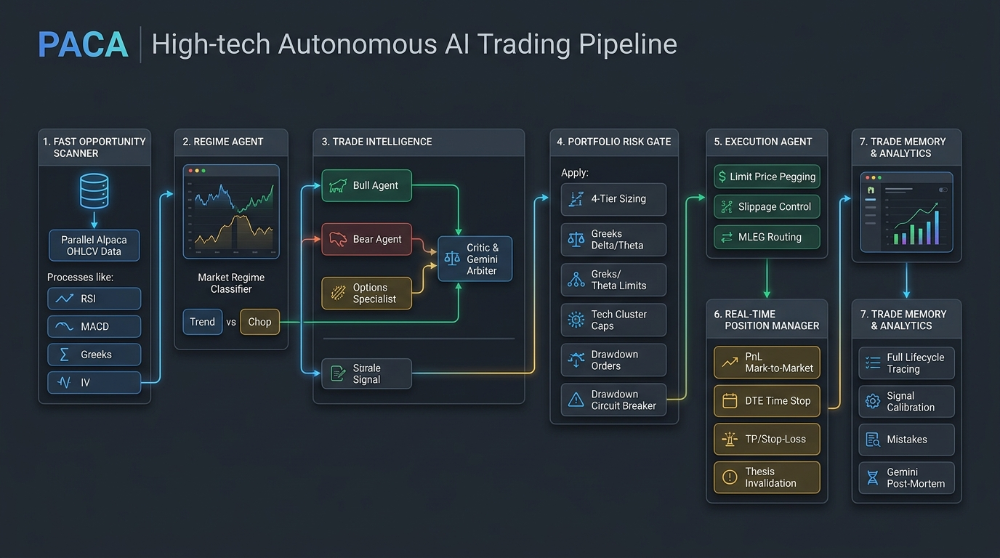
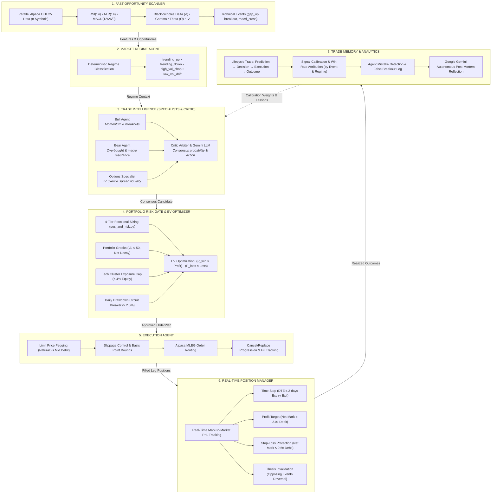

# PACA — Position-Aware Agentic Capital Allocator

An autonomous, institutional-grade multi-agent options trading system built for the **Alpaca AI Trading Agents Hackathon**. PACA trades **debit vertical spreads** using parallel real-time market scanning, specialist deliberation (Bull vs. Bear vs. Options), deterministic portfolio risk gating, intelligent order execution, active position management, and closed-loop memory calibration with Google Gemini.

---

## 🏛️ System Architecture





---

## 🔄 Architectural Transformation: Before vs. After Agents

| Feature / Dimension | 🛑 Before (Procedural Architecture) | 🚀 After (Multi-Agent Architecture) |
| :--- | :--- | :--- |
| **Control Flow** | Sequential procedural loop in `cli.py` | Directed 7-Agent Autonomous Pipeline with shared `AgentState` |
| **Market Ingestion** | Sequential symbol-by-symbol bar reading (~3.5s) | Parallel thread-pooled bar collection + pre-fetched account state (<3.0s) |
| **Trade Decision** | Single prompt LLM call or manual prompt | Multi-specialist deliberation: **Bull Specialist vs. Bear Specialist vs. Options Specialist** with **Critic Arbitration** |
| **Market Regime** | Static indicator thresholds | Dynamic **Regime Agent** categorizing market state (`trending_up`, `high_vol_chop`, etc.) to modulate confidence |
| **Portfolio Risk Sizing** | Basic equity percentage check | **4-Tier Fractional Sizing** + **Portfolio Greeks Limit ($|\Delta| \le 50$)** + **Tech Cluster Cap ($\le 4\%$)** + **Daily Drawdown Breaker ($\ge 2.5\%$)** |
| **Contract Optimization** | Static spread heuristic | **Expected Value (EV)** equation: $\text{EV} = (P_{\text{win}} \times \text{Max Profit}) - (P_{\text{loss}} \times \text{Max Loss})$ |
| **Order Execution** | Immediate order firing | **Natural vs. Mid Limit Pegging**, basis-point slippage bounds, MLEG order lifecycle |
| **Position Management** | Basic end-of-cycle polling | Active Mark-to-Market PnL, **DTE Time Stops ($\le 2\text{d}$)**, **Thesis Invalidation (Opposing Events)**, and automated closing MLEG plans |
| **Trade Memory & Calibration** | Unstructured line append to `cycles.jsonl` | Persistent `TradeMemoryRecord` buffer with **Signal Calibration**, **Regime Win Rates**, and **Gemini Post-Mortem Lessons** |
| **Cycle Latency** | ~7.3s (repetitive network roundtrips) | **2.97s total cycle** (~20.2 cycles/min) via connection pooling & state reuse |
| **Core Safety Math** | 100% Deterministic | Preserved 100% deterministic mathematical core; LLM is only applied where qualitative reasoning enhances the edge |

---

## 🧠 Central Intelligence: Deterministic Core vs. Gemini LLM

PACA implements a strict **division of labor** to ensure sub-millisecond execution safety while leveraging state-of-the-art LLM intelligence:

```
┌─────────────────────────────────────────────────────────────────────────────┐
│                       100% DETERMINISTIC CORE (< 5ms)                       │
│  • Mathematical Risk Sizing (pos_and_risk.py)                               │
│  • Strike & Expiration Banding (options_screener.py)                         │
│  • Mechanical Stops: Take-Profit (≥2.0x), Stop-Loss (≤0.5x), DTE (≤2 days)   │
│  • Portfolio Greeks Aggregation & Directional Delta Limits (|Δ| ≤ 50)       │
│  • Alpaca Paper MLEG Order Formatting & Paper-Trading Safeguards            │
└──────────────────────────────────────┬──────────────────────────────────────┘
                                       │ Enhanced by
                                       ▼
┌─────────────────────────────────────────────────────────────────────────────┐
│                     GOOGLE GEMINI CENTRAL INTELLIGENCE                      │
│  • Specialist Deliberation & Critic Arbitration (Decision Layer)            │
│  • Imminent Binary Event & Macro News Risk Advisory (Risk Gate)             │
│  • Open Position Qualitative Thesis Health Review (Position Manager)        │
│  • Autonomous Trade Post-Mortem & Calibration Lessons (Trade Memory)        │
└─────────────────────────────────────────────────────────────────────────────┘
```

---

## ⚡ The 7-Step Autonomous Pipeline

### Step 1: Fast Opportunity Scanner Agent
* Collects 50 completed 5-minute bars across 8 whitelisted underlyings (`SPY`, `QQQ`, `IWM`, `AAPL`, `NVDA`, `TSLA`, `MSFT`, `AMZN`) simultaneously.
* Computes `RSI(14)`, `ATR(14)`, `MACD(12/26/9)`, Black-Scholes Greeks ($\Delta, \Gamma, \Theta, \text{Vega}$), and Implied Volatility (IV).
* Identifies event triggers: `gap_up`, `gap_down`, `breakout_up`, `breakout_down`, `macd_cross_up`, `macd_cross_down`.
* Pre-fetches Alpaca account state concurrently, eliminating downstream network latency.

### Step 2: Market Regime Agent
* Classifies macro state into: `trending_up_low_vol`, `trending_down_high_vol`, `high_vol_chop`, `low_vol_drift`, or `normal`.
* Dynamically adjusts confidence multipliers (e.g. penalizing breakout trades in choppy regimes).

### Step 3: Trade Intelligence Agent
* **Bull Specialist**: Argues for bullish continuation using upward momentum, positive MACD, and breakout events.
* **Bear Specialist**: Defends against bull traps, scanning for resistance, high RSI divergence, and bearish setups.
* **Options Specialist**: Validates IV skew, liquidity bands, and volatility pricing.
* **Critic Arbiter**: Synthesizes the 3 arguments, resolves conflicts, and queries Google Gemini for qualitative consensus.

### Step 4: Portfolio Risk Gate & EV Optimizer
* Screens vertical debit spreads across the 3 nearest expiries ($\ge 5\text{ DTE}$) with widths between $2\%$ and $5\%$ of spot.
* Calculates Expected Value: $\text{EV} = (P_{\text{win}} \times \text{Max Profit}) - (P_{\text{loss}} \times \text{Max Loss})$.
* Enforces **4-Tier Fractional Risk Caps**:
  * Per entry $\le 0.5\%$ of equity.
  * Per underlying $\le 1.5\%$ of equity.
  * Per cycle $\le 1.0\%$ of equity.
  * Total open portfolio risk $\le 10.0\%$ of equity.
* Enforces **Tech Cluster Cap** ($\le 4.0\%$ across `NVDA, MSFT, AAPL, AMZN, TSLA, QQQ`).
* Trippable **Daily Drawdown Circuit Breaker** ($\ge 2.5\%$ loss halts new entries).

### Step 5: Execution Agent
* Optimizes limit prices between natural debit and mid debit.
* Bounds slippage against basis point thresholds.
* Formats Alpaca Multi-Leg (MLEG) orders with deterministic `client_order_id`.
* Manages order lifecycles and provides audio notifications on fill.

### Step 6: Real-Time Position Manager Agent
* Tracks real-time Mark-to-Market PnL and Greek sensitivities.
* Evaluates strict mechanical exit precedence:
  1. **Time Stop**: $\text{DTE} \le 2\text{ days}$ (prevents pin/gamma risk).
  2. **Thesis Invalidation / Reversal**: Opposing event fired against spread direction.
  3. **Profit Target**: Net mark $\ge 2.0\times$ entry debit ($+100\%$).
  4. **Stop-Loss**: Net mark $\le 0.5\times$ entry debit ($-50\%$).
  5. **Momentum Breakdown**: Severe RSI divergence ($< 28$) with bearish MACD.
* Constructs and routes closing MLEG order plans automatically.

### Step 7: Trade Memory & Analytics Agent
* Traces full trade lifecycles: `Prediction → Decision → Execution → Outcome`.
* Appends structured JSON records to `logs/trade_memory.jsonl`.
* Computes live calibration metrics: Win Rate, Profit Factor, Average PnL, Regime attribution.
* Autonomous Post-Mortem Reflection: Calls Google Gemini on trade exits to extract lessons for continuous calibration.

---

## 🛠️ Step-by-Step User Guide

### 1. Installation & Setup
Requires **Python 3.11** and [uv](https://docs.astral.sh/uv/).

```bash
# Clone repository
git clone https://github.com/maria2469/Alpaca-Ai-Hackathon.git
cd Alpaca-Ai-Hackathon

# Install all dependencies with uv
uv sync

# Configure your API credentials in .env
```

Your `.env` file must contain your **Alpaca Paper Trading Keys** and **Gemini API Key**:
```ini
ALPACA_API_KEY=your_alpaca_paper_key
ALPACA_SECRET_KEY=your_alpaca_paper_secret
ALPACA_PAPER=true
GEMINI_API_KEY=your_gemini_api_key
```

### 2. Verify System & Run Pytest Suite
Run the offline unit test suite (207 tests, 0 network calls, 100% mocked):

```bash
uv run pytest
```

### 3. Preflight & Diagnostics
Verify configuration, API keys, and Alpaca connectivity:

```bash
# Complete preflight check
uv run --env-file .env python -m cli preflight

# View paper account equity, options trading level, and open positions
uv run --env-file .env python -m cli account

# View live technical indicators and fired signals across all whitelisted symbols
uv run --env-file .env python -m cli candidates

# Screen option spreads for a specific underlying
uv run --env-file .env python -m cli screen SPY --direction CALL
```

### 4. Running Trading Cycles

#### Dry-Run Mode (Safe Simulation)
Evaluates market data, regime, specialist perspectives, risk sizing, and constructs the order plan **without submitting to Alpaca**:

```bash
uv run --env-file .env python -m cli run --dry-run
```

#### Single Live Paper Execution
Executes one full cycle and submits approved MLEG spread orders to your Alpaca Paper Account:

```bash
uv run --env-file .env python -m cli run --execute
```

#### Autonomous Continuous Loop
Runs the autonomous multi-agent pipeline continuously on every bar interval (default: 5 minutes = 300s):

```bash
uv run --env-file .env python -m cli run --execute --loop
```

### 5. Inspecting Trade Memory & Audits
Every cycle appends full structured traces to the audit logs:

```bash
# View latest trade memory lifecycle record
tail -n 1 logs/trade_memory.jsonl

# View cycle journal
tail -n 1 logs/cycles.jsonl
```

---

## ⏱️ Performance & Speed Profile

Benchmarked live against the Alpaca Paper API:

```text
================================================================================
7-STEP COMPLETE AUTONOMOUS PIPELINE SPEED BREAKDOWN
================================================================================
   1. Market Scanner Agent             : 2.969s (Parallel OHLCV bars & Greeks)
   2. Regime Agent                     : 0.0005s (Deterministic classification)
   3. Decision Agent (Bull/Bear/Critic): 0.0011s (Consensus arbitration)
   4. Portfolio Risk Gate & EV         : 0.0000s (4-tier risk sizing & Greeks)
   5. Execution Agent                  : 0.0000s (Limit pegging & routing)
   6. Real-Time Position Manager       : 0.0013s (Mark-to-Market & exit checks)
   7. Trade Memory & Analytics         : 0.0021s (Lifecycle tracing & stats)
   -----------------------------------------------------------------------------
   Total 7-Step Autonomous Cycle Time  : 2.974s (~20.2 cycles / minute)
   Pure Deterministic Compute          : < 0.005s
================================================================================
```

---

## 🛡️ Safety Rules & Hard Guards

1. **Strict Paper-Only Enforcement**: Startup aborts immediately if `ALPACA_PAPER != true` or if any live trading endpoint is detected.
2. **Hard-Coded Client Safety**: `TradingClient` is initialized with `paper=True` hard-coded in `broker.py`.
3. **Single Order Chokepoint**: `broker.submit_paper_order` is the single function permitted to submit orders.
4. **Credential Leak Prevention**: Exception handlers wrap all vendor errors to type names only (`from None`), ensuring API keys never appear in logs or stack traces.
5. **Options Level 3 Verification**: Checks that the Alpaca paper account has Options Trading Level $\ge 3$ before arming any spread orders.
6. **Unpaired Leg Isolation**: Positions that do not form recognized debit vertical spreads are flagged and never altered.
