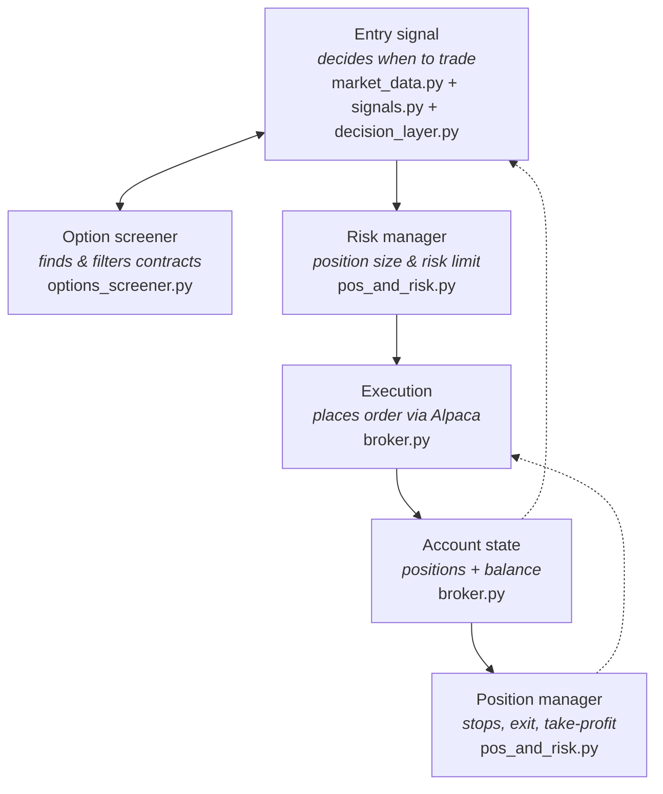

# PACA — Position-aware Agentic Capital Allocator

Options vertical spreads, paper only. An autonomous paper-trading agent for the
[**Alpaca AI Trading Agents Hackathon**](https://lablab.ai/ai-hackathons/alpaca-ai-trading-agents-hackathon)
(Aug 28 – Sep 4, 2026, submissions due Sep 4 15:00 UTC). Every cycle it scores a **whitelist of candidate
underlyings**, lets an LLM pick entries one at a time (up to `per_cycle_fraction /
per_entry_fraction` per cycle — 2 with the shipped settings), and trades **debit vertical
spreads** as single multi-leg (MLEG) limit orders. Exits are purely mechanical.

> [!TIP]
> **Live dashboards**, refreshed on every [`/paca-agent` run](#running-the-paca-agent):
> - [alpaca-hackathon-2026-artifacts-paca-cycles.surge.sh](https://alpaca-hackathon-2026-artifacts-paca-cycles.surge.sh)
>   — cycle journal, open positions with unrealized PnL, realized PnL per
>   closed spread, and trading config.
> - [alpaca-hackathon-2026-artifacts-paca-candles.surge.sh](https://alpaca-hackathon-2026-artifacts-paca-candles.surge.sh)
>   — every spread's entry and exit drawn over 5m candles with the RSI/ATR/MACD
>   signals, EMA 11/22, and the bars where entry events fired.
>
> **Presentation** for the hackathon judges:
> - [alpaca-hackathon-2026-artifacts-paca-deck.surge.sh](https://alpaca-hackathon-2026-artifacts-paca-deck.surge.sh)
>   — the case-study deck: 14 slides, every number rendered from the live
>   trading data.
> - [alpaca-hackathon-2026-artifacts-paca-video.surge.sh](https://alpaca-hackathon-2026-artifacts-paca-video.surge.sh)
>   — the recorded video walkthrough of the deck.
>
> How the pages are exported and deployed: [docs/DASHBOARDS.md](docs/DASHBOARDS.md).

> **Full rewrite (2026-08-31).** The previous phased single-underlying package
> (`src/regimepilot/`) was replaced with 7 flat modules. The old code lives in
> git history.

## Architecture



Each box in the diagram is one module:

| Diagram box | Module | Job |
|---|---|---|
| Entry signal (market data) | `market_data.py` | OHLCV DataFrame for one symbol at a time, any bar timeframe |
| Entry signal (analysis) | `signals.py` | RSI/ATR/MACD + event detection (gap, breakout, MACD cross) + entry gates (pure) |
| Entry signal (decision) | `decision_layer.py` | LLM (OpenRouter) — or you, with `--manual-mode` — picks one entry at a time from the event-firing candidates; asked again with the rest until the per-cycle cap (2 entries) is used |
| Option screener | `options_screener.py` | expiry pick, spread enumeration, liquidity filter, reward-to-risk ranking, order plans (pure) |
| Risk manager + Position manager | `pos_and_risk.py` | leg pairing, mechanical exits, equity-relative sizing (pure) |
| Execution + Account state | `broker.py` | all env/Alpaca access; `submit_paper_order` is the only submitting function |
| wiring | `cli.py` | typer CLI + the cycle engine + loguru logging + JSONL journal |
| — | `settings.yaml` + `settings.py` | every trader-tunable value in one validated file |
| — | `data_models.py` | frozen dataclasses shared by everything |

## Settings — the one file a trader edits

**`settings.yaml`** holds every tunable: the symbol whitelist, bar timeframe, TA
parameters and event trigger, screener thresholds, risk caps, stop/take-profit
levels, and the LLM models. Each value carries a comment saying what it does.
Edit, save, restart — nothing else to hunt down.

Every key is validated at startup (and by `cli.py preflight`): a missing key, a
typo'd key, a wrong type, or an out-of-range value stops the program naming the
exact key (e.g. `settings.yaml: exits.stop_fraction: must be in (0, 1), got 5`).
`.env` holds only credentials and the paper flag — secrets and strategy never mix.

## Methodology

Debit vertical spreads on a whitelist of liquid underlyings, entered on
ATR-scaled momentum events (gap, breakout, MACD cross) with an LLM picking
only the symbol and direction, sized as fractions of live equity, and exited
mechanically. The full rule set, one section per stage with the
`settings.yaml` key behind every number, lives in
[**docs/METHODOLOGY.md**](docs/METHODOLOGY.md):
[Whitelist](docs/METHODOLOGY.md#whitelist) ·
[Signals](docs/METHODOLOGY.md#signals) ·
[Decision](docs/METHODOLOGY.md#decision) ·
[Spread selection](docs/METHODOLOGY.md#spread-selection) ·
[Risk and sizing](docs/METHODOLOGY.md#risk-and-sizing) ·
[Exits](docs/METHODOLOGY.md#exits) ·
[Orders](docs/METHODOLOGY.md#orders).

Deeper studies behind individual rules: spread ranking and its worked example
in [docs/SPREAD_SELECTION.md](docs/SPREAD_SELECTION.md); the take-profit
rule and its TSLA example in [docs/TAKE_PROFIT.md](docs/TAKE_PROFIT.md); the
day-by-day evidence for every revision in
[docs/trading_review.md](docs/trading_review.md).

## Safety rules this code enforces

- Credentials from **environment variables only**; the `Config` repr redacts them.
- Startup **aborts** on `ALPACA_PAPER != true` (strict parse), any live flag
  (`ALPACA_LIVE`, `ALPACA_LIVE_TRADING`, `APCA_LIVE`), or any endpoint variable
  pointing at `api.alpaca.markets`.
- `TradingClient` is always built with `paper=True` hard-coded.
- `broker.submit_paper_order` is the **only** function that submits, runs only
  under `run --execute`, re-validates every plan, and reports an Alpaca refusal
  as the exception type name only. Nothing cancels, replaces or exercises.
- Vendor exceptions are wrapped to type names (`from None`) so request text and
  credentials never reach logs.
- Positions that don't pair into a known debit vertical are warned about and
  **never touched**.
- Missing market data is `None` or an explicit rejection, never a substitute value.
- Unit tests make **no** network calls.

## Setup

Requires Python 3.11 and [uv](https://docs.astral.sh/uv/).

```bash
uv sync
cp .env.example .env   # then paste your PAPER keys into .env
```

`.env` is git-ignored and never read by the code itself — pass it with
`uv run --env-file .env`. It holds only credentials: the Alpaca paper keys and
optionally `OPENROUTER_API_KEY` (for LLM decisions; use `--manual-mode` without
one). Strategy values live in `settings.yaml` (see Settings above).

## Run

```bash
uv run pytest                                   # no credentials, no network

uv run --env-file .env cli.py preflight                        # settings + credentials + connectivity check
uv run --env-file .env cli.py account                          # account state (read-only)
uv run --env-file .env cli.py candidates                       # scored whitelist (read-only)
uv run --env-file .env cli.py screen SPY --direction CALL      # what spread would be picked

uv run --env-file .env pnl.py positions [--json]               # open PnL per spread (Alpaca's marks)
uv run --env-file .env pnl.py realized [--json] [--days 30]    # PnL per closed spread, from filled orders

uv run --env-file .env cli.py run --manual-mode                # one cycle, dry run, you pick the entry
uv run --env-file .env cli.py run --manual-mode --execute      # one cycle, real PAPER order
uv run --env-file .env cli.py run --execute --loop             # autonomous, LLM, every 15 min
```

`--execute` is the only way an order is submitted; the client is still
paper-only. Every cycle appends one JSON line to `logs/cycles.jsonl`
(git-ignored) as an audit journal.

Spreads require Alpaca **options trading level 3** on the paper account; the
agent checks this before arming an entry.

### Running the `/paca-agent`

> [!NOTE]
> read this section for running this trading system as an autonomous agent 

The project ships a Claude Code skill (`.claude/skills/paca-agent/`) that runs
one full cycle with Claude as the momentum-trader entry decider: it gathers
`candidates`, `account` and recent journal context, reasons about the entry in
the open, pipes its pick into `run --manual-mode --execute` (the OpenRouter LLM
is never called), verifies the entered symbol matched its stated pick, then
redeploys the surge dashboard. Invoke it in a Claude Code session with:

```
/paca-agent
```

To run it repeatedly until the market closes, type this single line at the
Claude Code prompt:

```
/loop 5m /paca-agent — before starting each cycle check the current time; if it is 4:01pm ET or later, or the market is closed, do NOT run the cycle: stop the loop immediately
```

- Match the interval to `bar_timeframe` in `settings.yaml` (currently 5m,
  like `loop_interval_seconds: 300`) — one decision per completed bar; a
  tighter interval just re-reads the same bar.
- The deadline lives in the loop prompt, so every iteration re-checks the
  clock and the loop ends itself at/after 4:01pm ET.
- The loop lives in that terminal session — keep it open. Stop it anytime
  with Ctrl+C, or via `/tasks` (kill the loop task).
- Every iteration submits real **paper** orders (`--execute`), including
  mechanical exits, and redeploys the dashboard.

### Adding underlyings with `/whitelist-candidates`

A second skill (`.claude/skills/whitelist-candidates/`) vets new symbols for the
whitelist before they touch `settings.yaml`. Its read-only probe checks each
candidate against the *current* thresholds: enough bars on the IEX feed, a
strike grid that can form a spread in the width band, which expiries survive
the liquid-expiry filter and how many strikes near spot carry open interest,
and, during market hours, how many legs also clear the quote filter. It then
confirms with `cli.py screen`, recommends, and only edits `settings.yaml` and
this README after you pick. Example:

```
/whitelist-candidates COIN CVX TLT
```

### Reviewing the day with `/trading-review`

A third skill (`.claude/skills/trading-review/`) runs the after-close review that produced
[docs/trading_review.md](docs/trading_review.md). It digests the day's cycle journal
(`analyze.py`, read-only), pulls realized/open PnL from `pnl.py`, scores the previous
review's "Watch next session" items, grades every entry and pass against what prices did
afterwards, prepends a dated review section to `docs/trading_review.md`, and finishes with
prioritized recommendations — applying only the ones you pick, and committing nothing.
Run it after the close:

```
/trading-review
```

### Dry-run checklist: verify everything works end-to-end

Run these in order, during US market hours, with your paper keys in `.env`.
Nothing here submits an order.

```bash
# 1. Unit tests — pure logic, no credentials needed
uv run pytest

# 2. Preflight — validates every settings.yaml value, the credentials + paper
#    guards in .env, and Alpaca connectivity, in one shot
uv run --env-file .env cli.py preflight

# 3. Account state — shows equity + options level
#    (options_trading_level must be >= 3 to trade spreads later)
uv run --env-file .env cli.py account

# 4. Trading signals — RSI/ATR/MACD and fired events per whitelisted symbol.
#    On a calm bar most symbols show gate=no_event; that is the normal idle state.
uv run --env-file .env cli.py candidates

# 5. Option screener — the exact spread that would be picked for one symbol.
#    Also confirms the options feed returns implied volatility (a missing_iv
#    rejection count here means the feed has no IV and nothing can be ranked).
uv run --env-file .env cli.py screen SPY --direction CALL

# 6. Full dry-run cycle — exits evaluated, signals built, you pick a candidate
#    (or press Enter to pass), spread screened, risk-sized... but NOT submitted.
uv run --env-file .env cli.py run --manual-mode

# 7. Inspect the journal record the cycle just wrote
tail -1 logs/cycles.jsonl
```

Expected outcome of step 5: the log ends with `outcome: planned` (an entry or
exit was planned but not sent — the default is a dry run) or `outcome: hold`
(no event fired anywhere, nothing to do). The journal line from step 6 shows
every candidate, gate result, and the exact order plan that would have been
submitted. Only when all of this looks right add `--execute` for a real paper
order.
